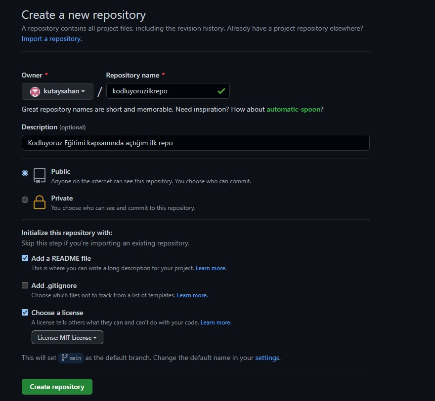

# Kodluyoruz Ilk Repo
Bu repo [Kodluyoruz](https://www.kodluyoruz.org/) Front-End Eğitiminde oluşturduğum ilk repo.



# Installation
Öncelikle projeyi clonelayın.
```
git clone https://github.com/kutaysahan/kodluyoruzilkrepo.git
```

# Usage
Projeyi cloneladıktan sonra Visual Studio Code programında açınız.

Linux için:

```
cd kodluyoruzilkrepo
code .
```

# Contributing
Pull requestler kabul edilir. Büyük değişiklikler için, lütfen önce neyi değiştirmek istediğinizi tartışmak için bir konu açınız.

# License 
[MIT](https://choosealicense.com/licenses/mit/)